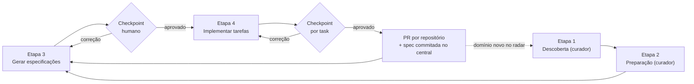

# Papéis e responsabilidades

Resumo de **quem faz o quê** no fluxo spec-driven do Clovis sobre um repositório central multirepo.
Leia este documento primeiro: ele diz qual dos outros dois guias é o seu.

| Documento | Para quem | Quando |
| --- | --- | --- |
| [Tutorial do curador](tutorial-curador.md) | quem monta o repositório central e roda as Etapas 1 e 2 | uma vez por projeto, e a cada domínio novo |
| [Guia do dia a dia](guia-diario-squad.md) | dev, PO, analista — todo mundo que consome o resultado | todo dia |
| Este documento | todos | antes de começar, e sempre que surgir dúvida de fronteira |

---

## Os dois papéis

O custo de entrada é pago **uma vez, por uma pessoa**; o restante da squad herda o resultado pronto.

| | **Curador** (1 pessoa) | **Squad** (todo mundo) |
| --- | --- | --- |
| Faz | Fundação do central + Etapas 1 e 2 do Clovis | Instalação na própria máquina + Etapas 3 e 4 do Clovis |
| Quando | uma vez por projeto, e de novo quando entra domínio novo | todo dia |
| Precisa de **escrita** em | repositório central | central (specs) e nos repositórios de produto que for alterar |
| Precisa de **leitura** em | todos os repositórios do inventário | os repositórios que for alterar |
| Produz | `functional-map.md`, `AGENTS.md`, `.agents/skills/` | `.agents/specs/` + código nos repositórios |

"Curador" é um papel, não um cargo: normalmente tech lead ou arquiteto, mas qualquer pessoa da squad
com visão do ecossistema pode assumir. O papel pode rodar entre pessoas — o que não pode é ninguém
assumi-lo, porque então o mapa funcional envelhece em silêncio.

---

## Responsabilidade por etapa

| Etapa do Clovis | Quem roda | Frequência | Saída |
| --- | --- | --- | --- |
| **Etapa 0** — configuração inicial | cada pessoa, na própria máquina | uma vez por máquina | login, agente, modelo (local, não versionado) |
| **Etapa 1** — Descobrir nova intenção | **curador** | uma vez por projeto, + domínio novo | `.agents/maps/functional-map.md` |
| **Etapa 2** — Instruções e documentação autoritativa | **curador** | uma vez por domínio | `AGENTS.md`, `.agents/skills/` |
| **Etapa 3** — Gerar especificações | **toda a squad** (dev e PO) | uma por unidade de trabalho | `.agents/specs/<numero-slug>/` |
| **Etapa 4** — Implementar tarefas | **dev** | a cada spec aprovada | código em `repositories/<repo>` |
| Utilitários (conversa livre, PR, code review, diagnóstico) | toda a squad | à vontade | variável |

Detalhes que costumam pegar:

- **As Etapas 1 e 2 só leem o código de produto.** O curador não precisa de escrita nos repositórios
  de produto — precisa conseguir cloná-los. A escrita necessária é no repositório central.
- **A Etapa 0 não é herdável.** `.clovis/cli-state.json` viaja no repositório (tipo de projeto e
  idioma dos artefatos), mas licença/login, agente escolhido, modelo e nível de raciocínio ficam na
  máquina de cada pessoa. Todo mundo faz a Etapa 0 uma vez, no próprio computador.
- **As Etapas 3 e 4 são de todos, e devolvem artefato ao central.** Cada spec gerada vive em
  `.agents/specs/` e precisa voltar para o repositório central. Se `main` for protegida, o time abre
  PR no central também — o que, aliás, dá revisão humana na spec antes de virar código.
- **`repositories/` nunca sobe.** O curador publica tudo menos os clones; quem clona o central
  reconstrói os projetos com um comando.
- **A squad não roda as Etapas 1 e 2 por conta própria.** Elas regeram o mapa funcional e a
  documentação que a squad inteira usa. Faltou um domínio? Acione o curador.

---

## Perfis dentro da squad

Dev e PO compartilham a mesma instalação e a mesma trilha até a Etapa 3. A separação é o que cada um
faz depois.

| | **Dev** | **PO / analista / negócio** |
| --- | --- | --- |
| Entra em | Etapas 3 e 4 + utilitários | Etapa 3 + conversa livre |
| Usa para | especificar, implementar, abrir PR, revisar código | descrever demanda, consolidar requisito, perguntar sobre o sistema, investigar bug |
| Escreve código? | sim | não, em nenhum momento |
| Clone recomendado | completo (precisa de `git log`, `git blame`) | `--depth 1` (mais rápido, só leitura) |

---

## O que é versionado onde

Regra de bolso: **código pertence ao git do repositório de produto; conhecimento pertence ao
central.**

| Artefato | Vive em | Versionado por | Produzido por |
| --- | --- | --- | --- |
| `.agents/maps/functional-map.md` | central | central | curador |
| `AGENTS.md`, `.agents/skills/` | central | central | curador |
| `.agents/specs/` | central | central | squad |
| `repositories.json` | central | central | curador (squad, ao entrar/sair repositório) |
| `.clovis/cli-state.json` | central | central (o resto de `.clovis/` é ignorado) | curador |
| Código-fonte | `repositories/<repo>` | o git de cada repositório | squad |
| Login, agente, modelo | máquina local | ninguém — não é versionado | cada pessoa |

---

## Ciclo de trabalho

O investimento das Etapas 1 e 2 se paga uma vez. O dia a dia é o ciclo curto.

---

## Quando acionar o curador

Sinais de que o harness precisa de manutenção — nenhum deles se resolve rodando a Etapa 1 por conta
própria:

| Sinal | O que provavelmente aconteceu |
| --- | --- |
| A Etapa 3 não oferece o domínio em que você vai mexer | domínio novo entrou sem passar pela descoberta |
| As respostas do agente ficaram genéricas ou desatualizadas | a documentação autoritativa envelheceu |
| O **Diagnóstico do harness** caiu de score | cobertura de documentação regrediu |
| Entrou um repositório novo na squad | `repositories.json` precisa de atualização e, talvez, nova onda de descoberta |
| O agente reinventa uma convenção que a squad já decidiu | a decisão não tem lar no `AGENTS.md` nem nas skills |
| Existe documentação de arquitetura (ADRs, guias, wiki, MCP) que o agente parece ignorar | a fonte não foi declarada nas restrições da descoberta; o curador precisa apontá-la e regerar as skills técnicas |
